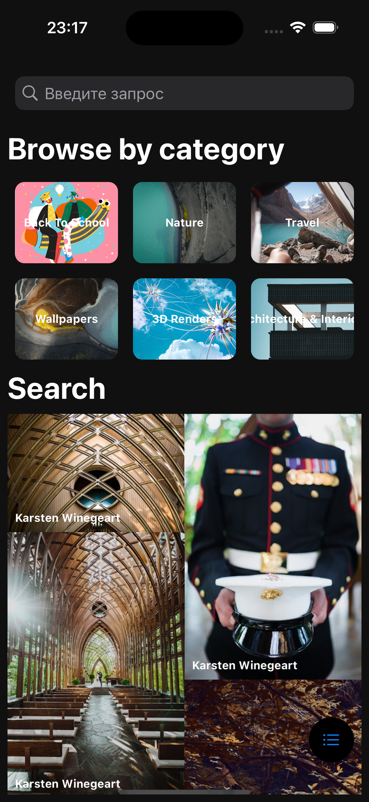
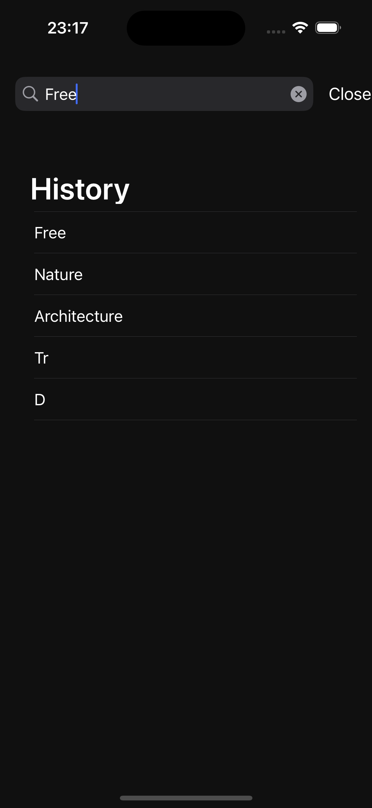
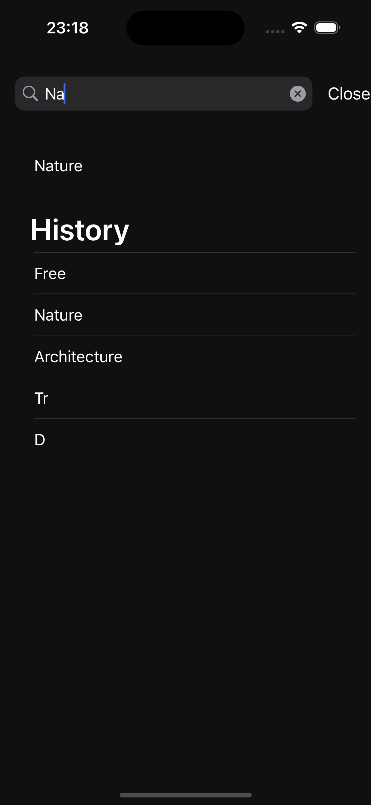
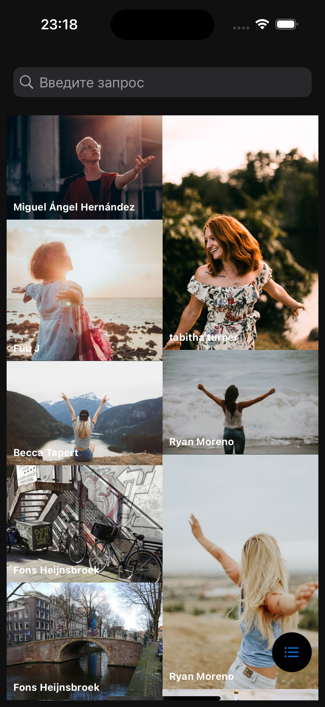
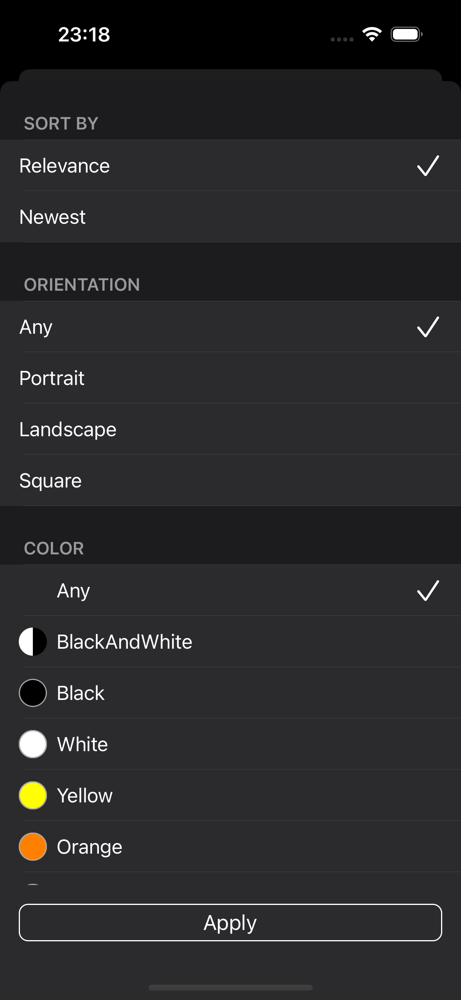
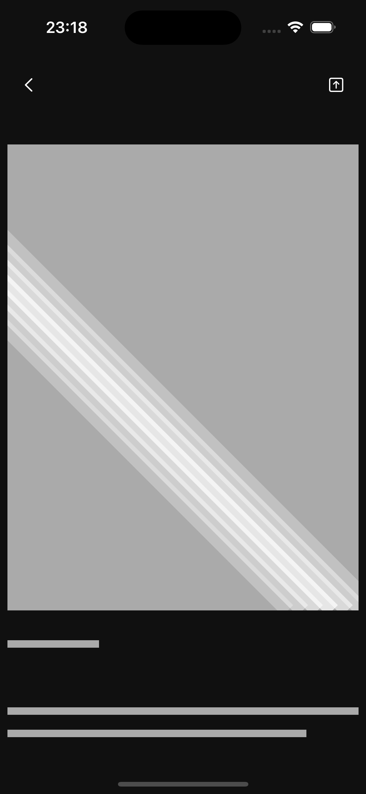

# Media Content Search App

## Описание

Это iOS-приложение позволяет искать медиа-контент с использованием Unsplash API. Приложение состоит из двух экранов:
- **Экран поиска**: Для поиска медиа-контента, отображения истории поиска и результатов.
- **Экран детальной информации**: Для отображения подробной информации о выбранном медиа-контенте.

## Особенности

- Поиск медиа-контента с использованием Unsplash API.
- История поиска (до пяти последних запросов).
- Подсказки при вводе запроса, фильтруемые по вхождению.
- Результаты поиска в виде плиток в два столбца.
- Экран детальной информации с изображением, описанием и информацией об авторе.
- Пагинация поиска (плюс).
- Функции сортировки и применения фильтров (плюс).
- Поделиться изображением и сохранить изображение в галерею (плюс).

## Скриншоты

<div style="display: flex; justify-content: space-between;">
    
    
    
</div>

<div style="display: flex; justify-content: space-between;">
    
    
    
</div>

(Добавьте изображения вашего приложения, если они есть)

## Установка и Запуск

### Требования

- iOS 13.0 или новее
- Xcode 12.0 или новее

### Установка

1. Клонируйте репозиторий:

   ```bash
   git clone https://github.com/yourusername/yourrepository.git
   ```


2. Запустите проект на симуляторе или реальном устройстве.


# Конфигурация API
Необходимо заменить YOUR_ACCESS_KEY в коде на ваш ключ доступа к Unsplash API.

# Использование
1. Запустите приложение.
2. На экране поиска введите запрос и нажмите клавишу "Поиск".
3. Результаты поиска будут отображены в виде плиток.
4. Нажмите на плитку для просмотра детальной информации.
5. На экране детальной информации вы можете увидеть изображение, описание и информацию об авторе.

# Вопросы и Проблемы
   - Как лучше отобразить коллекцию?   
   Если отображать ввиде плиток с заданными размеры, то фотографии не сохраняют пропорцию высоту/ширины. Из-за этого портится вид фотографии.   
   Принял решение реализовать Mansory Layout, чтобы сохранить отношение размеров
   - Где отображать историю поиска и подсказки?   
   Я пытался реализовать кастомное модальное представление с заданной высотой. У меня получилось реализовать свой контроллер, который занимает определенную высоту экрана,но когда открывается контроллер не на весь экран, он все равно блокирует интерфейс выше него. Отказался от кастомного контроллера со своим transition, persistance, etc. 
   Разместил imageView, внутри которого две таблицы ( подсказки, история поиска)
   Для его скрытия я реализовал кнопку "cansel" , визуально было красиво, если во время нажатия она вываливается справа и модальное представление. Из-за постоянной смены constarains для этой кнопки, Xcode ругается. Багов не нашел.
    Было две реализация через ссылку на констрэинт и через deactivate/activate.


# Логика Реализации
- Поиск медиа-контента: При вводе текста в строку поиска осуществляется запрос к Unsplash API.   
- Результаты отображаются в виде плиток. Используется UICollectionView для отображения результатов.
- История поиска: История хранится в UserDefaults и отображается в виде подсказок при вводе текста в строку поиска.
- Экран детальной информации: Отображает подробности о выбранном медиа-контенте.   
- Реализованы функции "Поделиться изображением" и "Сохранить изображение" (опционально).

# Контакты
 tg: @allison_ar